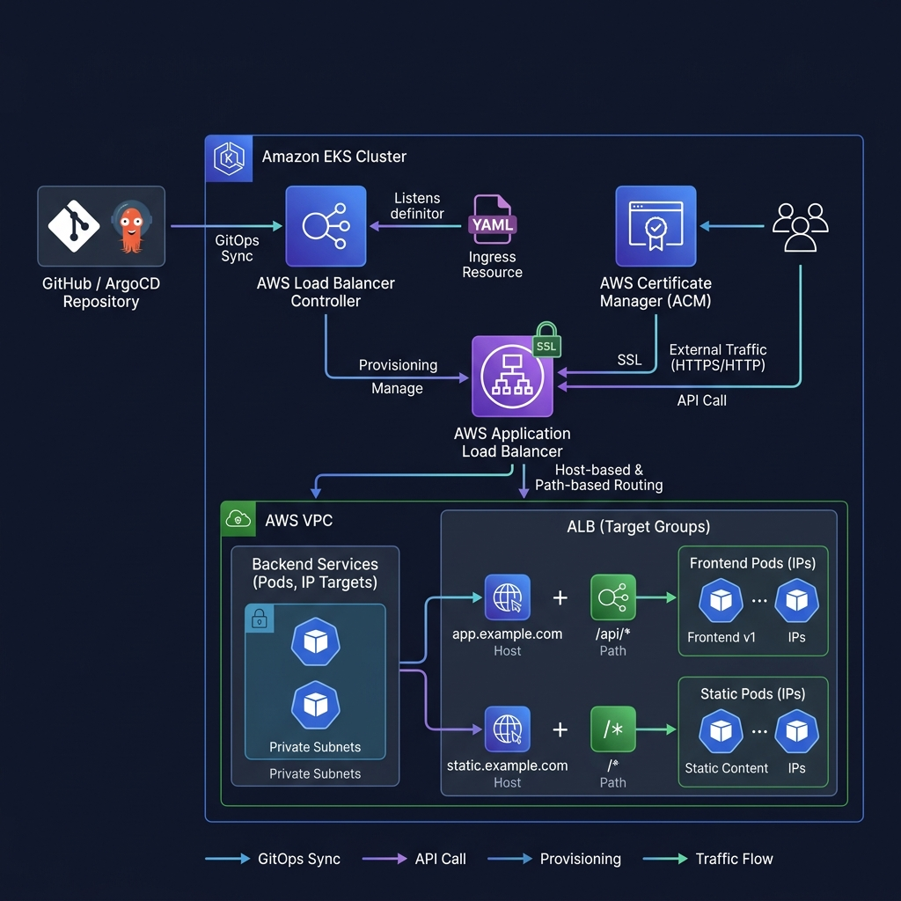

# Production ALB Ingress Setup on Amazon EKS

Deploy a modern, secure, and production-ready application infrastructure on Amazon EKS exposed through an AWS Application Load Balancer (ALB) using the AWS Load Balancer Controller. This project includes HTTPS support, SSL/TLS termination, and ingress-based routing (both Host-based and Path-based).

---

## Architecture Overview

Traffic flows from the client to the Amazon EKS pods through the following components:

```
GitHub / GitOps (Helm/ArgoCD)
    └── Amazon EKS Cluster
         └── AWS Load Balancer Controller
              └── AWS Application Load Balancer (ALB) <-- SSL Termination (AWS ACM)
                   ├── Route: Host (app.company.com) & Path (/app) -> web-app-service (IP Targets)
                   └── Route: Host (api.company.com) & Path (/api) -> api-app-service (IP Targets)
```

### Visual Topology


---

## Folder Structure

```text
alb-ingress-demo/
├── README.md                 # Main project documentation
├── controller-install.md    # AWS Load Balancer Controller installation guide
├── deployment.yaml           # Kubernetes deployment manifest (Web App + Mock API)
├── service.yaml              # Kubernetes ClusterIP services
├── ingress.yaml              # ALB Ingress configuration (Routing, SSL, Rules)
├── architecture.png          # Generated architecture diagram
├── screenshots/              # Folder for validation screenshots
└── .gitignore                # Exclude local files, credentials, and logs
```

---

## Step 1: AWS Certificate Manager (ACM) Setup

For production HTTPS, you must obtain a public SSL/TLS certificate through AWS ACM.

1. **Request a certificate** for your domain (e.g., `*.company.com` or specific domains like `app.company.com` and `api.company.com`):
   ```bash
   aws acm request-certificate \
       --domain-name "*.company.com" \
       --validation-method DNS \
       --subject-alternative-names "company.com"
   ```

2. **Validate ownership**: Complete the DNS validation process by adding the requested CNAME records to your DNS provider (e.g., Amazon Route 53).

3. **Verify certificate status**:
   ```bash
   aws acm list-certificates --certificate-statuses ISSUED
   ```
   *Note the Certificate ARN (e.g., `arn:aws:acm:us-east-1:123456789012:certificate/example-uuid`).*

---

## Step 2: Install AWS Load Balancer Controller

Refer to the step-by-step setup in [controller-install.md](controller-install.md) to:
1. Configure EKS OIDC provider.
2. Create IAM policy and service account role.
3. Install controller CRDs and Helm release.

Verify the controller is running:
```bash
kubectl get pods -n kube-system -l app.kubernetes.io/name=aws-load-balancer-controller
```

---

## Step 3: Deploy Applications & Services

Apply the application manifests to EKS. This will deploy two replicas of the Web App and two replicas of the Mock API.

```bash
# Deploy Applications
kubectl apply -f deployment.yaml

# Deploy Services
kubectl apply -f service.yaml
```

### Verification
```bash
# Check Deployments
kubectl get deployments -n default

# Check Pods
kubectl get pods -n default -l app=web-app
kubectl get pods -n default -l app=api-app

# Check ClusterIP Services
kubectl get svc -n default
```

---

## Step 4: Configure & Deploy Ingress

1. Open `ingress.yaml` and update the `alb.ingress.kubernetes.io/certificate-arn` annotation with your ACM Certificate ARN.
2. Deploy the Ingress resource:
   ```bash
   kubectl apply -f ingress.yaml
   ```

3. Monitor the creation of the Application Load Balancer:
   ```bash
   kubectl get ingress alb-ingress --watch
   ```
   *Expected output after 2-3 minutes: Address field populated with the ALB DNS name (e.g., `k8s-default-albingre-xxxxx.us-east-1.elb.amazonaws.com`).*

---

## Step 5: Routing Configuration

The Ingress is configured for two routing patterns:

### 1. Host-based Routing
* **`app.company.com`** -> Routes to `web-app-service`
* **`api.company.com`** -> Routes to `api-app-service`

### 2. Path-based Routing (on `app.company.com`)
* **`app.company.com/app`** -> Routes to `web-app-service`
* **`app.company.com/api`** -> Routes to `api-app-service`

### Testing Locally (Hosts File Simulation)
To test routing before pointing live Route 53 records:
1. Resolve the ALB DNS to an IP:
   ```bash
   nslookup <ALB_DNS_NAME>
   ```
2. Add entries to `/etc/hosts` (Linux/macOS) or `C:\Windows\System32\drivers\etc\hosts` (Windows):
   ```text
   <ALB_IP_ADDRESS> app.company.com
   <ALB_IP_ADDRESS> api.company.com
   ```
3. Test with `curl` (include `-k` to ignore SSL mismatch if using self-signed or invalid host certs):
   ```bash
   # Test Host-based Routing
   curl -H "Host: app.company.com" https://app.company.com --insecure
   curl -H "Host: api.company.com" https://api.company.com --insecure

   # Test Path-based Routing
   curl -H "Host: app.company.com" https://app.company.com/app --insecure
   curl -H "Host: app.company.com" https://app.company.com/api --insecure
   ```

---

## Security Best Practices

Our `ingress.yaml` configuration follows production-grade security standards:

1. **Forced HTTPS**: The `alb.ingress.kubernetes.io/ssl-redirect: '443'` annotation forces all HTTP (port 80) traffic to redirect automatically to HTTPS (port 443).
2. **IP Target Group Type**: Direct routing to pod IP addresses (`target-type: ip`) reduces double-hop routing through NodePorts, decreasing latency and improving load distribution.
3. **AWS WAF Integration** *(Optional annotation)*:
   To protect your application with a Web Application Firewall, add the WAFv2 ARN:
   ```yaml
   alb.ingress.kubernetes.io/wafv2-acl-arn: arn:aws:wafv2:us-east-1:123456789012:regional/webacl/main-waf/xxxxx
   ```
4. **Environment Isolation (Ingress Groups)**:
   For multi-tenant or multi-environment clusters, use `alb.ingress.kubernetes.io/group.name` to merge multiple Ingress resources into a single shared ALB, lowering costs:
   ```yaml
   alb.ingress.kubernetes.io/group.name: prod-ingress-group
   ```

---

## Debugging & Troubleshooting

### Issue 1: ALB is not created (Address field is blank)
* **Symptoms**: `kubectl get ingress` shows `ADDRESS` is empty after several minutes.
* **Reason**: AWS Load Balancer Controller cannot reconcile the Ingress resource due to authorization, subnet tagging, or configuration errors.
* **Diagnosis**:
  1. Inspect the controller logs:
     ```bash
     kubectl logs -n kube-system -l app.kubernetes.io/name=aws-load-balancer-controller --tail=100
     ```
  2. Describe the Ingress resource to look for events:
     ```bash
     kubectl describe ingress alb-ingress
     ```
  3. Ensure subnets are correctly tagged for ALB discovery:
     * **Public Subnets**: `kubernetes.io/role/elb` = `1`
     * **Private Subnets**: `kubernetes.io/role/internal-elb` = `1`

### Issue 2: SSL Handshake Failed
* **Symptoms**: Browser shows `ERR_SSL_PROTOCOL_ERROR` or CLI returns `SSL connection timeout`.
* **Reason**: Incorrect ACM certificate ARN, or certificate is still in `PENDING_VALIDATION`.
* **Diagnosis**:
  1. Verify ACM certificate is ISSUED:
     ```bash
     aws acm describe-certificate --certificate-arn <ACM_CERTIFICATE_ARN> --query "Certificate.Status"
     ```
  2. Double-check that `ingress.yaml` has the correct, matching certificate ARN.

### Issue 3: 502 Bad Gateway / 503 Service Unavailable (Target Unhealthy)
* **Symptoms**: Ingress returns `502 Bad Gateway` or `503 Service Unavailable`.
* **Reason**: The ALB target group health check is failing on EKS pod targets.
* **Diagnosis**:
  1. Verify pods are running and healthy:
     ```bash
     kubectl get pods -l app=web-app
     ```
  2. Check the endpoint resource:
     ```bash
     kubectl get endpoints web-app-service
     ```
  3. Verify port settings: Ensure the service port matches the container port (port 80).
  4. AWS Target Group console verification: Open the EC2 console under **Target Groups**, locate the generated target group, and inspect the health check status and failure reason.
